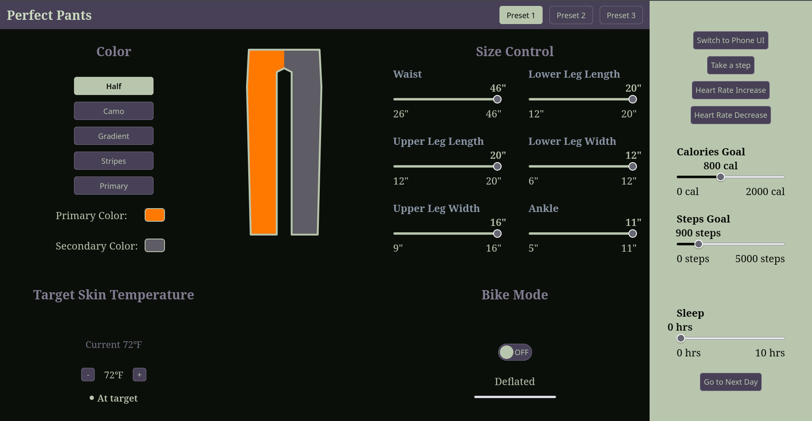
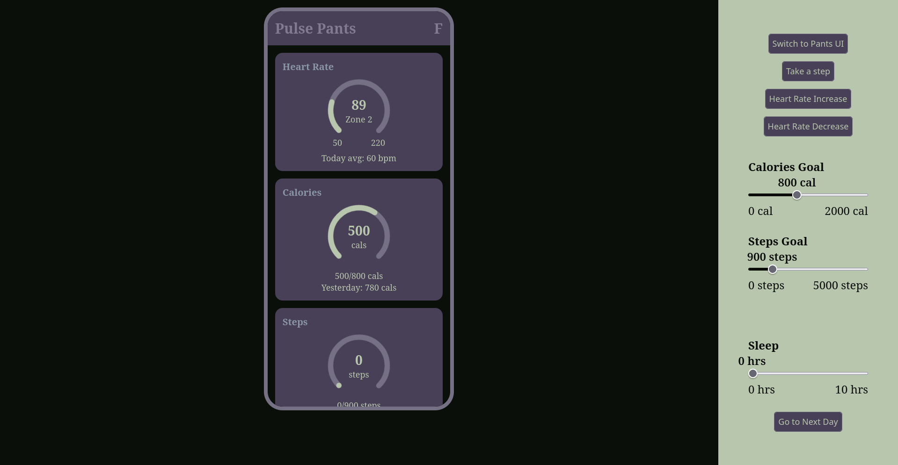
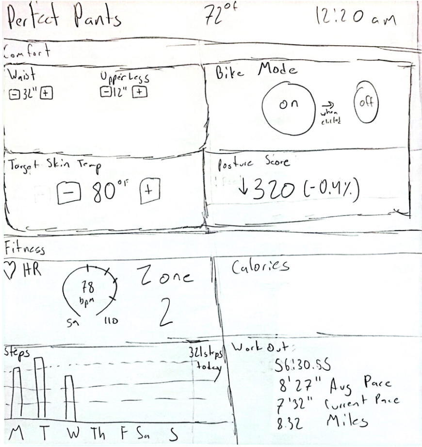
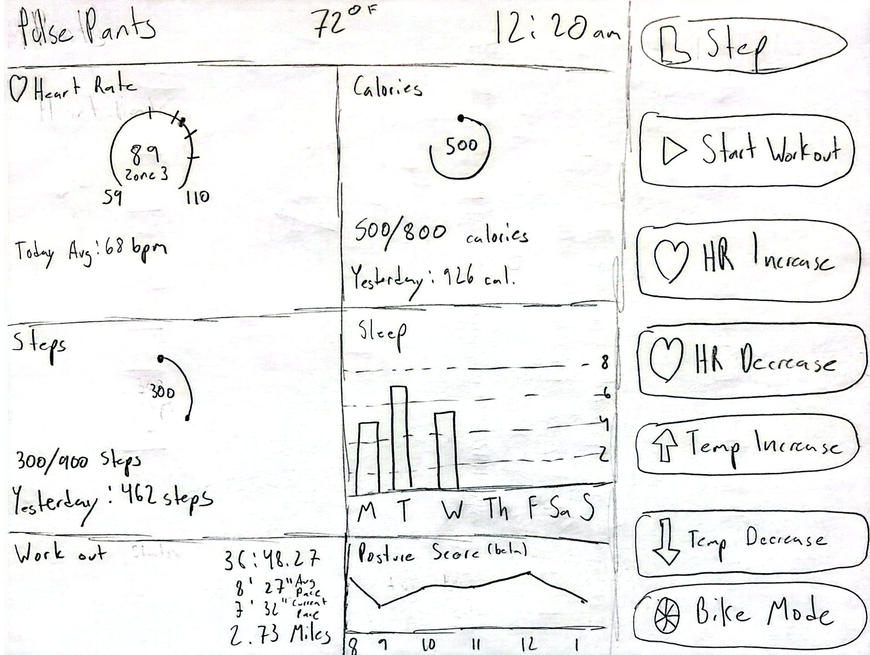
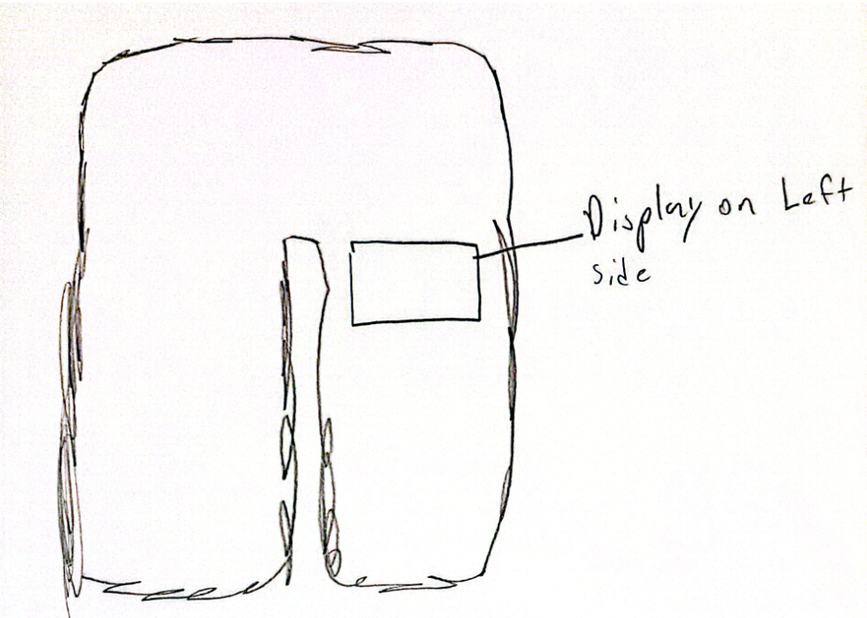
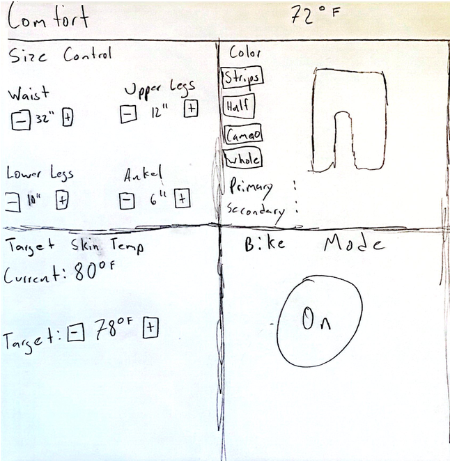
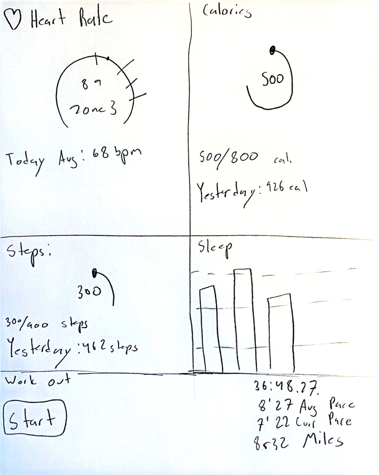
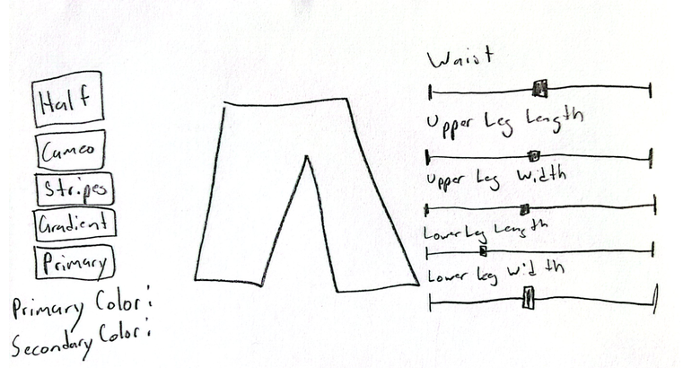
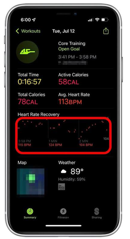
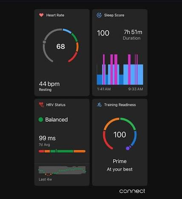

# Smart Pants Design

UI is publicly hosted here: https://jaberui.duckdns.org/

## Demo Video/Pictures

[Demo Video here](https://youtu.be/N9iCPz-TcTg)

## Affordances

Here are some of the affordances I came up with for my smart pants:

- The user can step into the pants and tighten or loosen the waistband.
- The user can wash the pants in a machine.
- The user can put things in the pockets, like a phone, keys, or a removable battery.
- The user can sit, squat, bend, and pedal while wearing them.
- The user can fold or roll them to pack in a bag.
- The user can glance down at the thigh display while walking or riding.
- The user can press or tap controls on the thigh, even with sweaty or gloved hands.
- The user can snap out the sensor pod or battery before washing so the pants can be machine washed safely.

### User Interviews

I asked the following questions to get a better idea of what people would want from smart pants:

1. Where would you want a display on your pants?
2. What are your favorite pants and why?
3. Is there something your pants don't do right now that you wish they did?
4. What are your reasons for purchasing new pants?
5. What is your favorite aspect of your pants?
6. How many pockets is too many pockets on your pants?
7. What is your favorite pants material?

Ashanth:
1. Thigh, would be easiest to see
2. Sweat Pants
3. Adjust size dynamically
4. The pants don't fit anymore
5. The style that each one of them has
6. More than 4 is too many
7. Denim

Adam:
1. Side of the thighs
2. Pajama Pants
3. Don't rip easily, and too hot
4. The previous one ripped
5. Loose and not tight
6. 4 on the front 2 in the back
7. Whatever is thinnest/lightest (not itchy)

Mosium: 
1. Crotch
2. White pants I have at home because they are comfortable
3. Too Hot
4. Don't fit anymore / Style is bad
5. Soft, clean colors, stylish
6. More than 6
7. Cargo pants material/cotton

Raphael: 
1. If there has to be a display the thigh
2. Nice comfortable pair of jeans because they are durable and they look good
3. No, they work
4. The old ones don't fit anymore
5. They fit well and they look good
6. Anything more than 4
7. Denim

These are the takeaways I got from the user interviews:

- Most people would prefer a display on the thighs
- They mainly get new pants because their old ones no longer fit
- Their should be 4-6 pockets

## User Needs

- Needs to feel comfortable temperature wise without stopping to remove/add layers
- Needs controls usable with sweaty or gloved hands
- Needs to avoid accidental input while sitting, bending, or during normal movement
- Needs to inflate to provide comfort while riding bike
- Needs to be able to adjust the size with the pants screen
- Needs to be able to adjust temperature with the pants screen
- Needs to be able to change colors and patterns of pants

## Design Requirements and sensing features

- Heart rate sensor
- Skin temperature sensors
- Motion sensor - detects steps
- Moisture/sweat level sensor (Later scrapped)
- Embedded heating/cooling elements
- Calories Burned tracker
- Sleep Score (Later scrapped)
- Posture Check (Later scrapped)
- Ability to change the size of the pants

## Sketches

These were the original sketches:

I later had the idea to have one screen on the pants for comfort (Perfect Pants) and and another on your phone for exercise (Pulse Pants):

## Inspiration

## What I Would Add Given More Time

I would have liked to make a light and dark mode. I would also have liked to hold down the testing buttons on the right to make the values change rapidly.

## AI Use

I have only used AI when it came to helping with css. 
